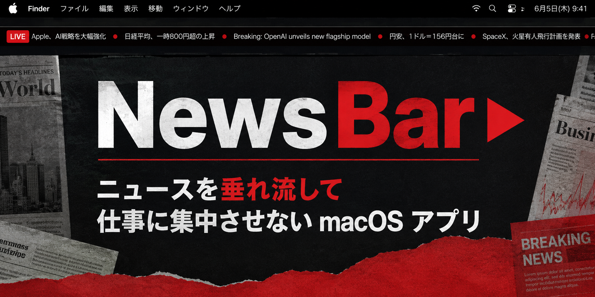

# NewsBar



> 🗞️ **ニュースを垂れ流して仕事に集中させない macOS アプリ** 📰

macOS のメニューバーに RSS / Atom のニュース見出しを右から左に流し続けるアプリ。見出しを **左クリック** すればブラウザで記事が開きます。

## 特徴

- 任意の RSS / Atom フィードを登録（NHK / BBC / Hacker News などをデフォルトで同梱）
- 60fps のなめらかなスクロール
- 帯の幅・スクロール速度・更新間隔を調整可能
- **左クリック**: その位置の見出しをブラウザで開く
- **右クリック / Ctrl+クリック**: 設定ダイアログを開閉

## インストール

[Releases](https://github.com/ibukimatsubara/NewsBar/releases) から最新の `NewsBar-x.y.z.dmg` をダウンロードし、`NewsBar.app` を `Applications` にドラッグ。

初回起動時のみ、Apple Developer ID 未署名のため Gatekeeper の検疫属性を外す必要があります:

```bash
xattr -dr com.apple.quarantine /Applications/NewsBar.app && open /Applications/NewsBar.app
```

## ソースからビルド

```bash
git clone https://github.com/ibukimatsubara/NewsBar.git
cd NewsBar
./install.sh
```

## ログイン時に自動起動

システム設定 → 一般 → ログイン項目 → 「開いた時」の **+** から `NewsBar` を追加。

## ライセンス

MIT
